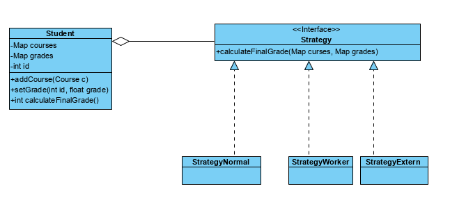

# Aula sobre o pattern Strategy

## Problema
O calculo da média do curso é realizado de forma distinta em função do tipo de estudante (normal, worker, extern)

### Solução Comum:
- Uso de um atributo Type do tipo enumerado
```java
public class Student {

    public enum TYPE {NORMAL,WORKER,EXTERN};
    private TYPE type;
    private int id;
    //...

    public Student(int id, Student.TYPE type) {
        this.id = id;
        this.type=type;
        /....
    }
```
O método que impelmenta o calculo da nota final usa uma estrutura switch case para diferenciar o tipo de calculo a fazer.
```java

    public float calculateFinalGrade()    {
        float result=0.0f, finalGrade=0.0f;
        int count=0;

        switch (type) {
            case NORMAL:
                //code2              
                break;

            case WORKER:
                //code2
                break;
            case EXTERN:
               //code3
                break;
        }
        return finalGrade;
    }

}
```
### Questões ?
- Se for preciso adicionar mais um tipo de estudante, quais as alterações a fazer?
- Se as regras de passagem dos estudantes também variar em função do seu tipo, o que acontece?
- Usarmos o polimorfismo seria uma boa solução para resolver este problema?

### Aplicação do Padrão Strategy
- Difinir a interface Strategy
- Implementar as classes que a instanciam (um por cada tipo)
- Alterar a classe Student, substituindo o atributo type por um atributo strategy
- Redefinir o metodo calculateFinalGrade, delegando o calculo à estretegia em "vigor".
- Correr o método main 


## Exercícios
 - Adicione um novo tipo de estrategia de calculo da nota final  : INTERNACIONAL, em que a nota é calcula no modo do estudante do work, mas convertida na seguinte escala.
    - 5 Nota superior a 18
    - 4 Nota superior a 15
    - 3 Nota Superior a 12
    - 2 Nota superior ou igual a 10
    - 1 Nota inferior a 10
 - O criterio de passagem do estudante difere dependente do seu tipo 
    - NORMAL - 50% das uc aprovadas (>9.5)
    - WORKER - 2 ucs aprovadas (>9.5)
    - EXT - todas as ucs aprovadas (>9.5)
    - INTERNACIONAL - todas as uc com nota >= D
    Implemente o código necessário para disponibilizar o método
    ```java   boolean isApproved() ``` que devolve true se o estudante estiver aprovado.  
    Nota: Deverá usar o padrão Strategy
